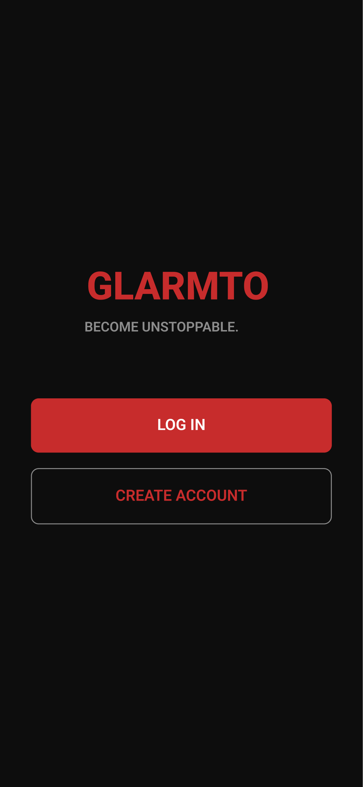
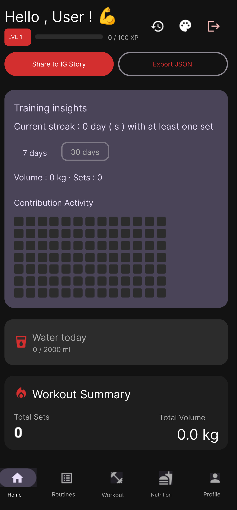
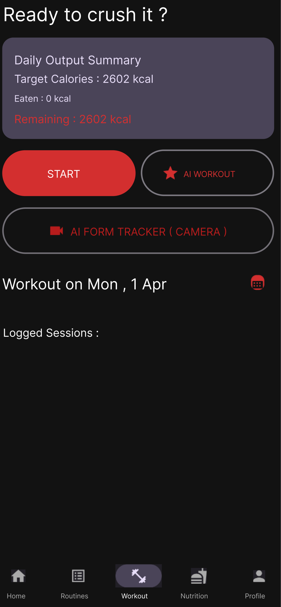
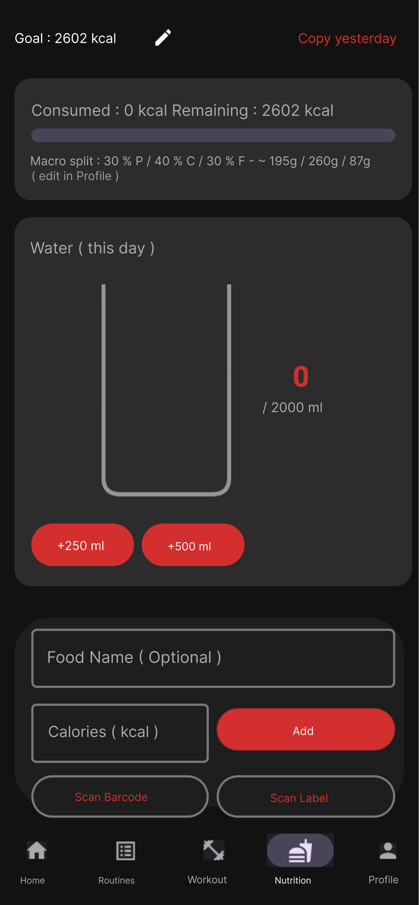
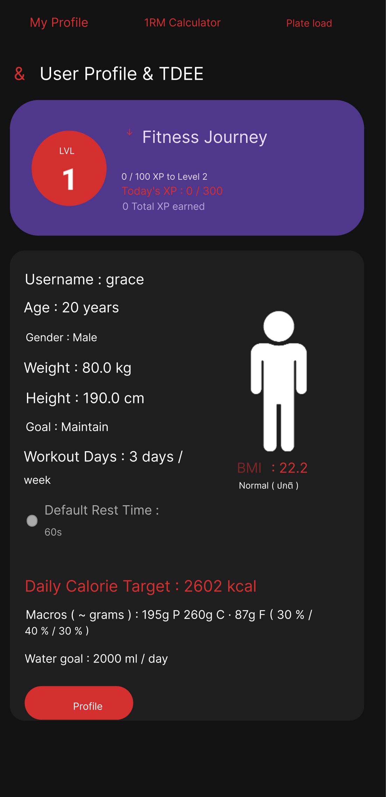
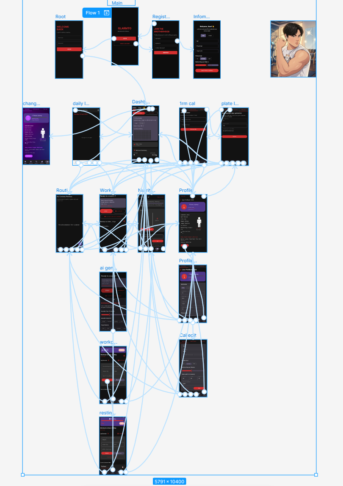

<div align="center">
  
  <h1>💪 GlarmTo (กล้ามโต) - Smart Fitness Companion 🤖</h1>
  <p>The Ultimate AI-Powered Workout Tracker & Gamified Fitness Experience</p>

  <!-- Badges -->
  <p>
    
    
    
    
    
  </p>
  
  <h3>
    <a href="https://github.com/Graceiscoming/CP213_LearnAndroid/releases/latest">
      
    </a>
  </h3>
</div>

---

## 🌟 About The Project (ภาพรวมโปรเจกต์)

**GlarmTo (กล้ามโต)** ไม่ใช่แค่แอปพลิเคชันจดบันทึกการออกกำลังกายธรรมดา แต่เป็น **"ผู้ช่วยส่วนตัวอัจฉริยะ"** ที่รวมเอาเทคโนโลยี **AI** และศาสตร์ของ **Gamification** เข้าด้วยกัน เพื่อลบภาพจำการจดบันทึกที่น่าเบื่อ ให้กลายเป็นการเล่นเกมที่คุณอยากเอาชนะตัวเองในทุกๆ วัน

เอกสารฉบับนี้จัดทำขึ้นเพื่อแสดงให้เห็นถึง **"ศักยภาพและสถาปัตยกรรมเชิงลึก"** ของแอปพลิเคชัน โดยรวบรวมรายละเอียดฟังก์ชันทั้งหมด โครงสร้างไฟล์ และเทคนิคการเขียนโค้ด เพื่อให้อาจารย์ผู้อ่านสามารถเข้าใจการทำงานของแอปได้ทะลุปรุโปร่งเห็นภาพชัดเจนแม้ไม่ได้ทำการรันโค้ดด้วยตัวเอง

---

## 🔥 Comprehensive Feature List (ฟีเจอร์ทั้งหมดที่แอปทำได้)

แอปพลิเคชันถูกแบ่งออกเป็น 5 หมวดหมู่การใช้งานหลัก ซึ่งครอบคลุมทุกมิติของ Fitness Lifestyle:

### 🤖 1. AI & Smart Technologies (ระบบอัจฉริยะ)
*   🎙️ **Voice-to-Text Workout Logging:** ระบบบันทึกเซ็ตด้วยเสียง เพียงกดไมค์แล้วพูด เช่น *"สควอท 100 กิโล 8 ครั้ง"* ระบบจะใช้อัลกอริทึม NLP ดึงชื่อท่า น้ำหนัก และจำนวนครั้งไปกรอกให้อัตโนมัติ (รองรับคำสั่งภาษาไทยและอังกฤษ)
*   📹 **AI Form Tracker (Pose Detection):** ใช้กล้องมือถือสแกนผ่าน **Google ML Kit** เพื่อจับจุดข้อต่อร่างกาย (Skeleton) แบบ Real-time คอยเช็คความลึกของการ Squat และการเคลื่อนไหว
*   🧠 **AI Workout Generator:** สุ่มสร้างแผนการซ้อมรายวัน (Customized Routines) ให้ผู้ใช้งานพร้อมเริ่มกดเล่นได้ทันที

### 🎮 2. Gamification & Progression (ระบบเกมมิฟิเคชัน)
*   🏅 **Level & XP System:** ทุกน้ำหนัก จำนวนครั้งที่ยก รวมถึงการกินอาหาร จะถูกคำนวณเป็นค่าประสบการณ์ (XP) เมื่อหลอดเต็มจะมีการ Level Up 
*   📊 **GitHub-Style Heatmap:** ตารางความขยันจุดสีเขียว ยิ่งซ้อมเยอะสียิ่งเข้ม ช่วยให้ผู้ใช้ติดตามความสม่ำเสมอและเก็บสถิติ Streak (วันซ้อมต่อเนื่อง)
*   📱 **Instagram Story Sharing:** สร้างภาพการ์ดสถิติประจำวัน (มี Level, Streak, แคลอรีเบิร์น) พร้อมพื้นหลังสวยงามและอวาตาร์ของตัวเอง เพื่อแชร์ลง IG Story ได้ในคลิกเดียว
*   🎉 **Post-Workout Confetti:** เอฟเฟกต์พลุฉลองความสำเร็จเมื่อซ้อมเสร็จ พร้อมให้ผู้ใช้ประเมินความเหนื่อย (Exhaustion Rating)

### 🏋️ 3. Workout Control (การควบคุมการซ้อม)
*   🕒 **Picture-in-Picture (PiP) Rest Timer:** นาฬิกาจับเวลาพักเซ็ตสุดล้ำที่สามารถ "ย่อเป็นหน้าต่างลอย" (Floating Window) ทับแอปอื่นได้ (ผู้ใช้สามารถไถหน้าจอโซเชียลระหว่างพักเซ็ตได้โดยที่เวลายังคงนับถอยหลังให้เห็น)
*   📈 **Smart Exercise Suggestions:** ระบบ Auto-suggest ที่คอยจดจำพฤติกรรมและเดาท่าต่อไปที่กำลังจะเล่น ช่วยลดเวลาในการพิมพ์ค้นหา
*   📅 **Calendar & History:** ระบบปฏิทินดูประวัติย้อนหลัง ทั้งแบบรายวัน (Daily) ดูรายละเอียดแต่ละเซ็ต และสรุปภาพรวมรายเดือน (Monthly)
*   📝 **Custom Routines:** สามารถสร้างและเซฟแพทเทิร์นตารางฝึกประจำ (เช่น Leg Day) เพื่อให้วันต่อไปกดโหลดรวดเดียวไม่ต้องพิมพ์ใหม่

### 🧮 4. Advanced Calculators & Nutrition (โภชนาการและการคำนวณ)
*   🍔 **TDEE & Macro Tracker:** คํานวณพลังงานที่ใช้ต่อวันและแจกแจงโควต้า P/C/F (โปรตีน/คาร์บ/ไขมัน) ตามเป้าหมายส่วนบุคคล
*   📷 **Barcode Food Scanner:** ฟีเจอร์สุดล้ำสแกนบาร์โค้ดสินค้าด้วย **Google ML Kit (Barcode Scanning)** เพื่อดึงข้อมูลโภชนาการ (แคลอรี, โปรตีน) เข้าแอปอัตโนมัติ โดยเชื่อมต่อกับฐานข้อมูลสินค้าไทยกว่า 600+ รายการและ OpenFoodFacts API
*   🌊 **Animated Water Tracker:** ระบบบันทึกการดื่มน้ำที่มาพร้อม "แอนิเมชันคลื่นน้ำ (Wave Effect)" ที่ระดับน้ำจะค่อยๆ เพิ่มสูงขึ้นตามแก้วน้ำจริง
*   💪 **1RM (One-Rep Max) Calculator:** เครื่องมือประเมินระดับความแกร่งสูงสุด (ยกได้หนักสุดกี่กิโล) ด้วยสูตรคณิตศาสตร์ Epley Formula
*   🏋️ **Plate Load Calculator:** เครื่องมือช่วยคำนวณการใส่แผ่นเหล็ก (Plates) บนบาร์เบล ว่าต้องใส่แผ่น 20kg หรือ 10kg ข้างละกี่แผ่นให้ได้น้ำหนักพอดี
*   🔋 **Muscle Recovery Status:** หน้าปัดแสดงค่าความล้าของกล้ามเนื้อแต่ละส่วน (อก, หลัง, ขา) โดยวิเคราะห์ตามปริมาณเซ็ตที่เล่นไปในช่วง 48 ชั่วโมงที่ผ่านมา

### ⚙️ 5. OS-Level & Utilities (ระบบพื้นฐานและความสวยงาม)
*   🌌 **Dynamic Theming & Glassmorphism:** ธีมแอปพลิเคชัน 5 สไตล์ (Aura, Ocean, Neon, Forest, Blood Red) พร้อมเอฟเฟกต์กระจกโปร่งแสงสุดพรีเมียม
*   💾 **Local Data Export:** ความสามารถในการส่งออกประวัติการเล่นทั้งหมดออกมาเป็นไฟล์ JSON หรือ CSV เพื่อง่ายต่อการแบคอัป
*   🔐 **Local Authentication:** ระบบ Login/Register บันทึกข้อมูลแยก User ภายในเครื่องเดียว
*   🚀 **120Hz Smooth UI:** มีการใช้คำสั่งระดับ System ดันเฟรมเรตหน้าจอให้ลื่นไหลสูงสุด เพื่อรีดประสิทธิภาพแอนิเมชันของ Jetpack Compose

---

## 🏗️ Architecture & Project Directory (สถาปัตยกรรมและหน้าที่ของไฟล์)

โปรเจกต์นี้เขียนด้วย **Kotlin** และใช้ **Jetpack Compose** ทั้งหมด โครงสร้างโค้ดถูกออกแบบตามหลัก **MVVM (Model-View-ViewModel)** และ **Clean Architecture** อย่างเป็นระเบียบ เพื่อให้โค้ดดูแลรักษาง่าย (Maintainable)

เพื่อให้เห็นภาพการทำงานเชิงลึก ด้านล่างคือแผนผังหน้าที่ของแต่ละโฟลเดอร์และไฟล์สำคัญ (ไล่จากระดับ Data ไปจนถึง UI):

### 📁 `data/` (Data Layer - ชั้นจัดการข้อมูล)
หน้าที่: จัดการฐานข้อมูล (Local DB) และการประมวลผลลอจิกหนักๆ
*   📂 **`local/` (Room Database)**
    *   `AppDatabase.kt` และ `dao/GlarmToDao.kt`: กำหนด Schema และคำสั่ง SQL (Insert, Query, Delete)
    *   `entity/`: ไฟล์โครงสร้างตาราง เช่น `UserEntity` (เก็บ XP, เลเวล), `WorkoutEntity` (เก็บชื่อท่า, น้ำหนัก), `NutritionEntity`
*   📂 **`preferences/`**
    *   `SessionManager.kt`: ใช้ SharedPreferences จัดการสถานะ Login
    *   `ThemeManager.kt`: จัดการการเปลี่ยนธีมและอัปเดตแบบ Real-time
*   📂 **`repository/`**
    *   **`GlarmToRepository.kt`**: **(ไฟล์หัวใจสำคัญของการจัดการข้อมูล)** ทำหน้าที่เป็น Single Source of Truth ดึงข้อมูลจาก DAO เพื่อป้อนให้ ViewModel ไฟล์นี้รวมตรรกะที่ซับซ้อน เช่น:
        - ลอจิกการคำนวณ XP (จำกัดโควต้า 300 XP ต่อวัน) และการ Level Up
        - อัลกอริทึมการคำนวณ Streak (วันซ้อมต่อเนื่อง)
        - ลอจิกการดึงข้อมูลรายสัปดาห์มาทำกราฟเรดาร์และ Heatmap
*   📂 **`util/`**
    *   **`InstagramShareHelper.kt`**: คลาส Helper ที่แยกออกมาเขียนโค้ดวาด Canvas/Bitmap เพื่อแชร์ลง IG โดยเฉพาะ (การแยกไฟล์นี้โชว์ถึงความเข้าใจเรื่อง Single Responsibility Principle เพื่อไม่ให้ ViewModel มีลอจิกของการวาด UI ปนอยู่)

### 📁 `ui/` (Presentation Layer - ชั้นแสดงผล)
หน้าที่: จัดการหน้าจอ UI ทั้งหมดด้วย Jetpack Compose โดยมีการแบ่งโฟลเดอร์ตามฟีเจอร์อย่างชัดเจน
*   📂 **`dashboard/`**
    *   `DashboardScreen.kt`: หน้าแรกสุด รวมชาร์ต Heatmap, Radar Chart, และแถบ Recovery
    *   **`DashboardViewModel.kt`**: ดึงข้อมูลจาก Repository แล้วแปลงให้อยู่ในรูปแบบ `StateFlow` เพื่อส่งให้ UI อัปเดตข้อมูลแบบ Reactive
*   📂 **`workout/`**
    *   `WorkoutScreen.kt`: หน้าจดบันทึกเซ็ต มีปุ่มไมค์เรียกคำสั่งเสียง และปุ่มเริ่มจับเวลา
    *   **`WorkoutViewModel.kt`**: จัดการลอจิก Speech-to-Text สกัดคำสั่งเสียง และระบบ Auto-suggest ชื่อท่าออกกำลังกาย
*   📂 **`camera/`**
    *   **`CameraXTracker.kt`**: โค้ดควบคุม CameraX ที่นำไปเชื่อมกับ ML Kit ดึงจุด Joint (ข้อต่อ) มาคำนวณระยะและความลึกในการนั่ง Squat 
*   📂 **`nutrition/` & `calculator/`**
    *   หน้าจอสำหรับกรอกอาหาร (NutritionScreen) ผสมแอนิเมชันคลื่นน้ำ และหน้าจอรวมเครื่องคิดเลข 1RM/Plate Load/TDEE
*   📂 **`history/` & `routines/`**
    *   หน้าจอสำหรับดูปฏิทินย้อนหลัง และหน้าจัดการเทมเพลตแผนการซ้อม

### 📄 `MainActivity.kt` (Entry Point)
*   **หน้าที่หลัก:** เป็นจุดเริ่มต้นของแอป ทำหน้าที่เป็น Host หลักให้กับ Jetpack Compose ควบคุม **Navigation Graph** (การสลับหน้าไปมา), ดักจับพฤติกรรมตอนกดยุบแอปเพื่อเข้าสู่โหมด Picture-in-Picture, และมีคำสั่งระดับ OS ในการบังคับจอแสดงผลไปที่ 120Hz เพื่อความสมูทสูงสุด

---

## 📸 Screenshots & Wireframes

<div align="center">
  
  
  
  
  <br>
  <br>
  
  
  
  
  
  <br>
  <i>ภาพ Wireframe โครงสร้างหน้าจอหลักจากขั้นตอนการออกแบบ</i>
</div>

> [🔗 คลิกเพื่อดู Figma Wireframe ฉบับเต็มได้ที่นี่](https://www.figma.com/design/J0VdZH5uxkX7j6y8v43CV6/Mobile-app?node-id=0-1&t=lydNLnpRY32mfKTV-1)

---

## 🛠️ Technology Stack & Learning Curve (สิ่งที่เราได้เรียนรู้)

โปรเจกต์นี้เป็นโครงงานเดี่ยวที่มีความท้าทายสูงมาก เนื่องจากมีการศึกษาและเลือกใช้เทคโนโลยีระดับ Modern Android Development ขั้นสูง ที่อยู่นอกเหนือจากเนื้อหาพื้นฐาน:

- **Jetpack Compose**: ย้ายจากระบบ View/XML แบบเก่า มาเขียน UI ด้วยโค้ดแบบ Declarative ช่วยเพิ่มความยืดหยุ่นในการจัดหน้าจอและทำ Animation ได้ลื่นไหล
- **CameraX + Google ML Kit**: ท้าทายอย่างมากในการจัดการ Lifecycle ของกล้อง และการใช้คณิตศาสตร์ดึงพิกัด (X,Y) ของร่างกายมาคำนวณองศาข้อต่อแบบ Real-time
- **Picture-in-Picture (PiP)**: การเขียนให้แอปย่อส่วนเป็นหน้าต่างลอยทะลุกรอบ Lifecycle ปกติ เพื่อแก้ปัญหาผู้ใช้ชอบเล่นมือถือเพลินระหว่างการพักเซ็ต
- **SpeechRecognizer API**: การแปลงเสียงพูดเป็นข้อความและเขียนเงื่อนไข (NLP) เพื่อสกัดชื่อท่า ตัวเลขน้ำหนัก และจำนวนครั้ง ออกมาแยกกรอกลงช่องโดยอัตโนมัติ
- **Room Database & StateFlow**: เปลี่ยนการดึงข้อมูลแบบดั้งเดิมมาเป็นการใช้ StateFlow ดักฟังความเปลี่ยนแปลงแบบ Reactive ทำให้กราฟและตัวเลขใน Dashboard อัปเดตทันทีที่ผู้ใช้บันทึกเซ็ตใหม่เสร็จ

---

## 🚀 Getting Started (วิธีการรันและทดสอบ)

### 💡 วิธีที่ 1: ตรวจผ่านไฟล์ APK โดยตรง (Fast & Recommended)
เพื่อความสะดวกและความรวดเร็วในการตรวจ อาจารย์สามารถดาวน์โหลดไฟล์แอปพลิเคชันไปติดตั้งลงบนสมาร์ทโฟน Android ได้ทันที โดยเข้าไปที่แท็บ **"Actions"** (ด้านบนของ GitHub Repository นี้) ระบบ CI/CD จะทำการ Build ไฟล์ `GlarmTo-Debug-APK` ไว้ให้อัตโนมัติทุกครั้งที่มีการอัปเดตโค้ด

### 💻 วิธีที่ 2: รันผ่าน Android Studio
1. Clone โปรเจกต์:
   ```bash
   git clone https://github.com/Graceiscoming/CP213_LearnAndroid.git
   ```
2. เปิดโปรเจกต์ใน **Android Studio (Jellyfish หรือใหม่กว่า)** โดยเลือกเปิดที่โฟลเดอร์ `Project/GlarmTo`
3. รอจังหวะให้ Gradle ทำการโหลดและ Sync ไลบรารีให้สำเร็จ
4. **แนะนำอย่างยิ่ง** ให้เชื่อมต่อ **สมาร์ทโฟน Android เครื่องจริง** เพื่อรันโปรเจกต์ (แทนการใช้ Emulator) เนื่องจากฟีเจอร์ "กล้อง AI จับท่าทาง" และ "ระบบสั่งการด้วยเสียง" ต้องการเข้าถึงฮาร์ดแวร์จริงเพื่อให้ได้ประสบการณ์สูงสุด
5. กดปุ่ม `Run` (สัญลักษณ์ Play สีเขียว) หรือ `Shift + F10`

---
